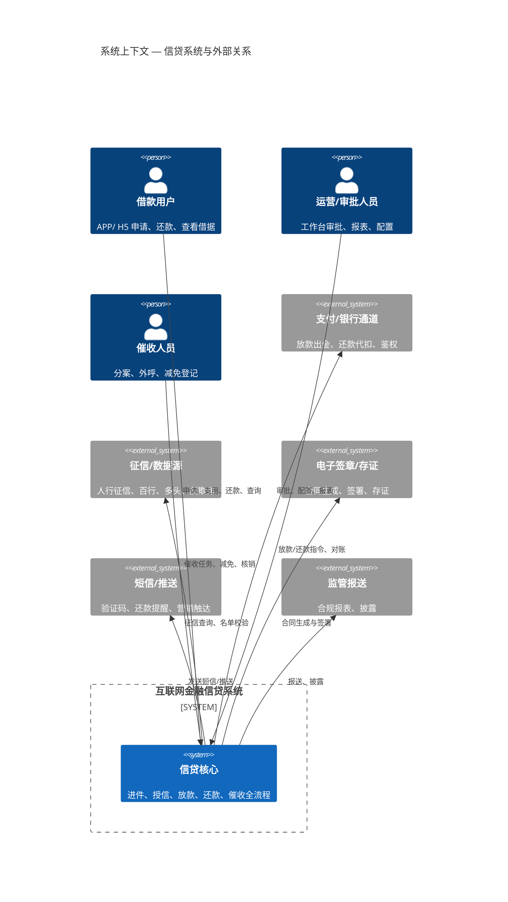
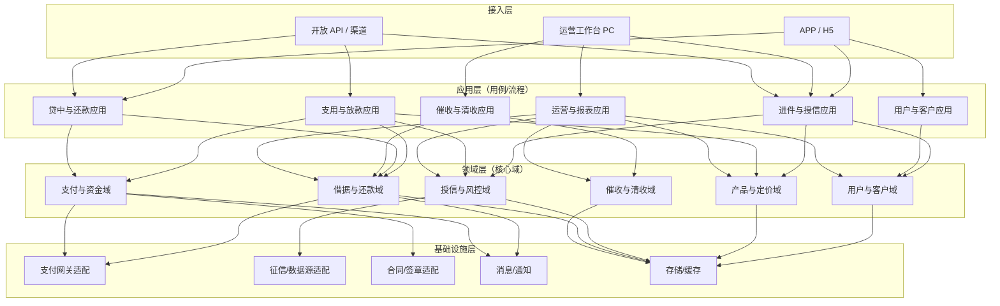
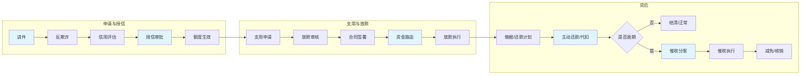
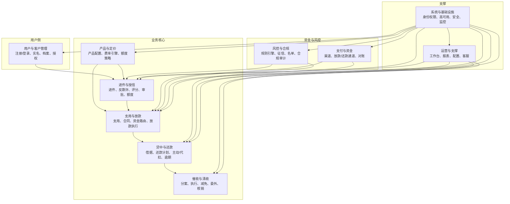
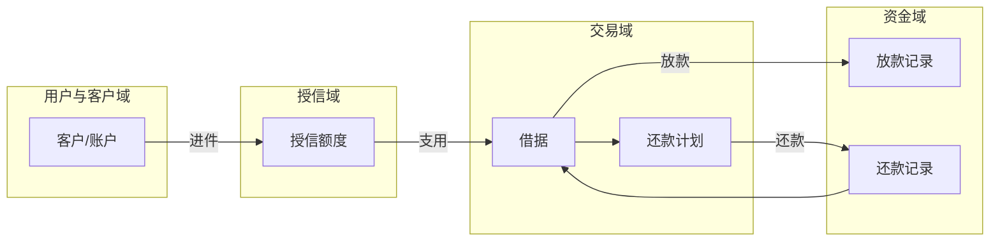
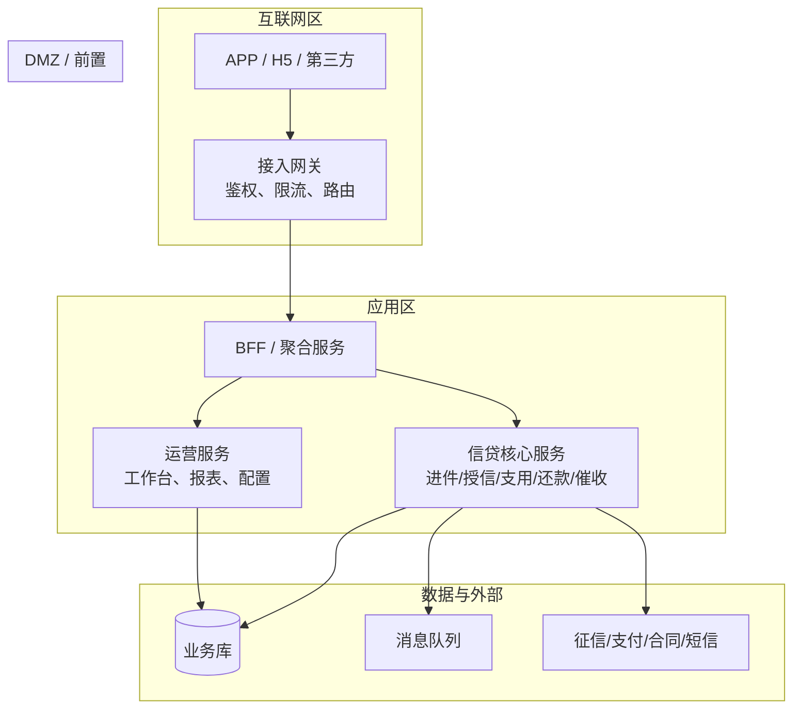

# 互联网金融信贷系统 — 系统架构图

> 基于 [ArchTech.md](./ArchTech.md) 功能需求，从**系统/业务架构**视角描述各域边界、分层与协作关系。  
> 图表使用 Mermaid，可在 GitHub / VS Code / 支持 Mermaid 的 Markdown 预览中直接渲染。

---

## 1. 系统上下文（C4 Context）

系统与外部用户、合作方、监管的交互关系。

---

## 2. 业务分层架构（Layered View）

按「接入层 → 应用层 → 领域层 → 基础设施层」划分，对应 ArchTech 中的功能域。

---

## 3. 核心业务流程（端到端）

从「申请 → 授信 → 支用 → 放款 → 还款 → 催收」的主流程与涉及系统模块。

---

## 4. 功能域与模块划分（模块图）

与 ArchTech 十大功能域一一对应，标出域间主要依赖。

---

## 5. 数据流概览（简化）

核心业务对象在域间的产生与流转方向。

---

## 6. 部署与边界（逻辑部署）

从「谁访问谁」看各部分的逻辑部署边界（不涉及具体技术栈，技术栈见 DetailedTechStackDiagram.md）。

---

## 图例与说明

| 图 | 用途 |
|----|------|
| 1 系统上下文 | 系统与用户、支付、征信、监管等外部系统关系 |
| 2 业务分层 | 接入/应用/领域/基础设施分层，对应功能域 |
| 3 核心业务流程 | 申请→授信→支用→放款→还款→催收 主流程 |
| 4 功能域与模块 | 十大功能域及域间依赖，与 ArchTech 一致 |
| 5 数据流概览 | 客户→授信→借据→还款计划/放款/还款 数据流向 |
| 6 部署与边界 | 互联网区 / DMZ / 应用区 / 数据与外部 逻辑边界 |

如需按**技术栈与组件**展开（语言、框架、中间件、部署方式），请参见 [DetailedTechStackDiagram.md](./DetailedTechStackDiagram.md)。
