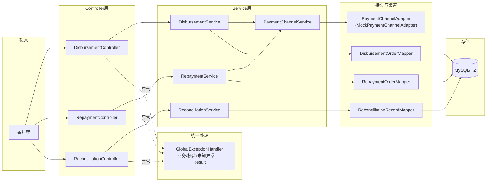
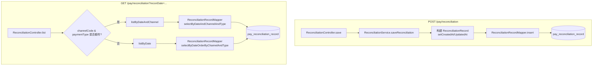
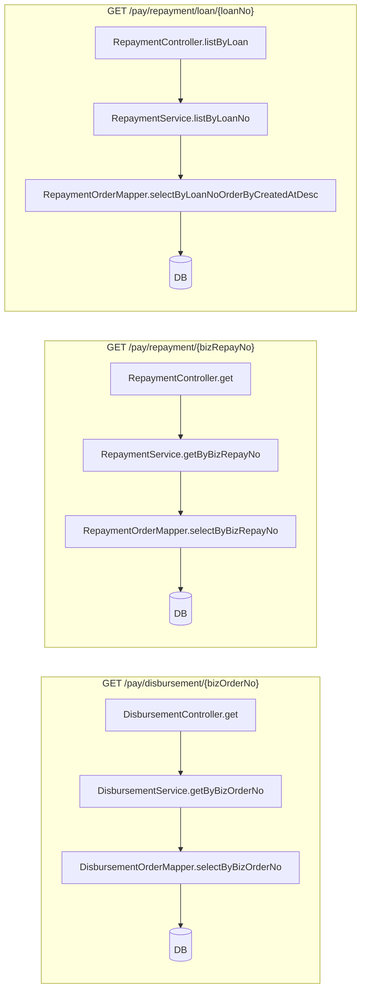

# 已实现代码调用流程图

> 基于当前完成的 **支付/资金服务** 模块（Java + Spring Boot + MyBatis），从请求入口到数据库/渠道的调用关系与流程说明。  
> 图表为 Mermaid，可在 GitHub / VS Code 等支持 Mermaid 的 Markdown 预览中渲染。

---

## 1. 总体请求链路

请求进入后的分层与组件关系（支付模块 + 公共层）。



---

## 2. 放款（Disbursement）调用流程

从 **POST /api/pay/disbursement** 到落库与渠道调用的完整时序。

```mermaid
sequenceDiagram
    participant C as 客户端
    participant DC as DisbursementController
    participant DS as DisbursementService
    participant PCS as PaymentChannelService
    participant Adapter as PaymentChannelAdapter
    participant DM as DisbursementOrderMapper
    participant DB as 数据库

    C->>DC: POST /pay/disbursement (DisbursementRequest)
    Note over DC: @Valid 参数校验
    DC->>DS: createAndExecute(request)

    DS->>DM: existsByBizOrderNo(bizOrderNo)
    DM->>DB: SELECT
    DB-->>DM-->>DS: false

    DS->>PCS: getAdapter(channel)
    PCS-->>DS: MockPaymentChannelAdapter

    DS->>DS: 构建 DisbursementOrder，setCreatedAt/UpdatedAt
    DS->>DM: insert(order)
    DM->>DB: INSERT pay_disbursement_order
    DB-->>DM-->>DS: order.id 回填

    loop 最多 maxAttempts 次
        DS->>Adapter: disburse(bizOrderNo, amount, payeeId, ...)
        Adapter-->>DS: DisbursementResult(success, channelSerialNo)
        alt 成功
            DS->>DS: setChannelSerialNo, status=SUCCESS
            DS->>DM: updateById(order)
            DM->>DB: UPDATE
            DS-->>DC: order
        else 失败
            DS->>DS: setFailReason, retryCount++
        end
    end

    opt 全部失败
        DS->>DS: status=FAILED
        DS->>DM: updateById(order)
        DS-->>DC: order
    end

    DC->>C: Result.ok(order)
```

---

## 3. 还款（Repayment）调用流程

从 **POST /api/pay/repayment** 到还款单落库与渠道代扣的时序。

```mermaid
sequenceDiagram
    participant C as 客户端
    participant RC as RepaymentController
    participant RS as RepaymentService
    participant PCS as PaymentChannelService
    participant Adapter as PaymentChannelAdapter
    participant RM as RepaymentOrderMapper
    participant DB as 数据库

    C->>RC: POST /pay/repayment (RepaymentRequest)
    RC->>RS: createAndExecute(request)

    RS->>RM: selectByBizRepayNo(bizRepayNo)
    RM->>DB: SELECT
    DB-->>RM-->>RS: null
    Note over RS: 不重复则继续

    RS->>PCS: getAdapter(channel)
    RS->>RS: 构建 RepaymentOrder，setCreatedAt/UpdatedAt
    RS->>RM: insert(order)
    RM->>DB: INSERT pay_repayment_order

    loop 重试
        RS->>Adapter: repay(bizRepayNo, loanNo, amount, payerId, payerAccount)
        Adapter-->>RS: RepaymentResult(success, channelSerialNo)
        alt 成功
            RS->>RM: updateById(order)
            RS-->>RC: order
        end
    end

    RC->>C: Result.ok(order)
```

---

## 4. 对账（Reconciliation）调用流程

**提交对账记录** 与 **按日期/渠道查询** 两条路径。



---

## 5. 查询类接口流程（简化）

放款/还款的 **GET** 查询不经过渠道，只读库。



---

## 6. 异常与统一响应

Controller 或 Service 抛出的异常由 **GlobalExceptionHandler** 捕获并封装为 **Result**。

```mermaid
flowchart TB
    Request["HTTP 请求"]
    Request --> Controller["Controller"]
    Controller --> Service["Service"]
    Service --> MapperOrAdapter["Mapper / Adapter"]

    Service -->|抛 BusinessException| Handler["GlobalExceptionHandler"]
    Controller -->|抛 MethodArgumentNotValidException\n(BindException/ConstraintViolationException)| Handler
    MapperOrAdapter -->|抛其他 Throwable| Handler

    Handler --> Result["Result&lt;T&gt;\ncode, message, data"]
    Result --> Response["HTTP 响应"]
```

---

## 7. 组件与包结构对应

| 流程图中的组件 | 代码位置 |
|----------------|----------|
| DisbursementController | `com.winder.pay.controller.DisbursementController` |
| RepaymentController | `com.winder.pay.controller.RepaymentController` |
| ReconciliationController | `com.winder.pay.controller.ReconciliationController` |
| DisbursementService | `com.winder.pay.service.DisbursementService` |
| RepaymentService | `com.winder.pay.service.RepaymentService` |
| ReconciliationService | `com.winder.pay.service.ReconciliationService` |
| PaymentChannelService | `com.winder.pay.service.PaymentChannelService` |
| PaymentChannelAdapter | `com.winder.pay.adapter.PaymentChannelAdapter` |
| MockPaymentChannelAdapter | `com.winder.pay.adapter.MockPaymentChannelAdapter` |
| DisbursementOrderMapper | `com.winder.pay.mapper.DisbursementOrderMapper` + `mapper/DisbursementOrderMapper.xml` |
| RepaymentOrderMapper | `com.winder.pay.mapper.RepaymentOrderMapper` + `mapper/RepaymentOrderMapper.xml` |
| ReconciliationRecordMapper | `com.winder.pay.mapper.ReconciliationRecordMapper` + `mapper/ReconciliationRecordMapper.xml` |
| GlobalExceptionHandler | `com.winder.common.exception.GlobalExceptionHandler` |
| Result | `com.winder.common.result.Result` |

---

以上流程图覆盖当前已实现的 **放款、还款、对账** 的完整调用链与异常处理路径，可与 [ArchTechDiagram.md](./ArchTechDiagram.md)、[DetailedTechStackDiagram.md](./DetailedTechStackDiagram.md) 对照阅读。
