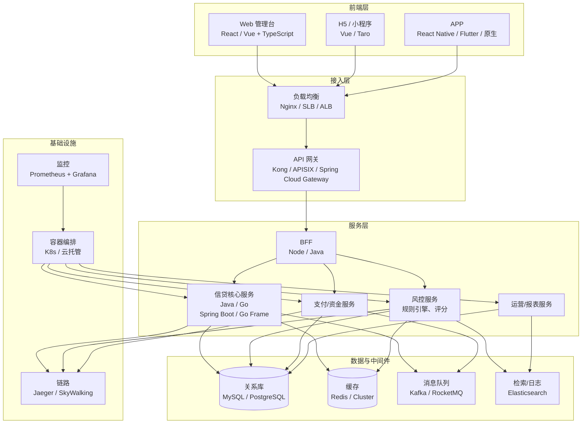
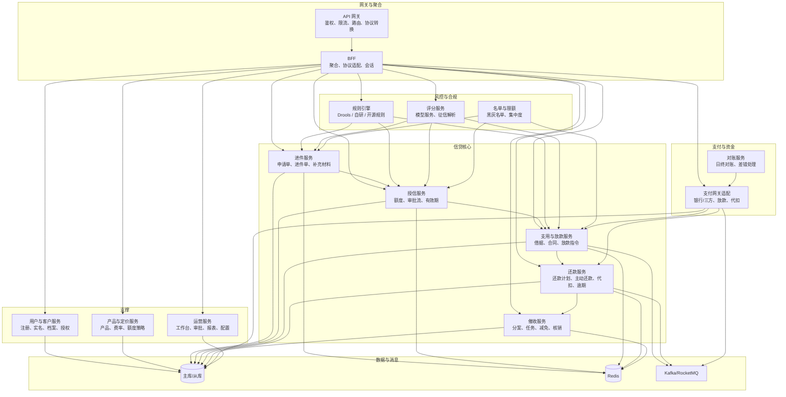
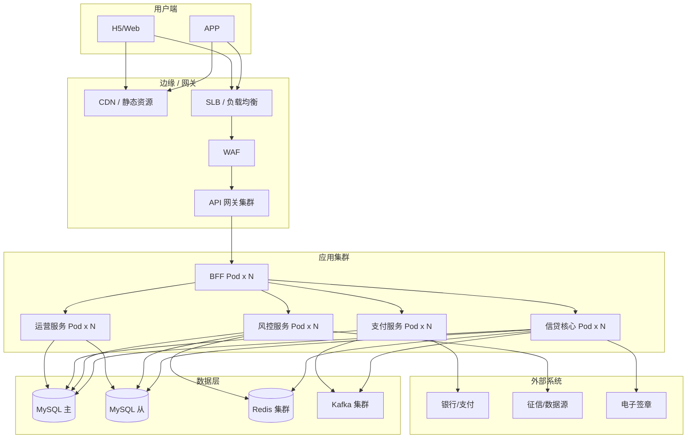
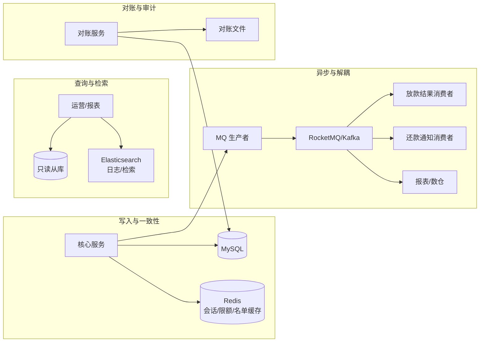
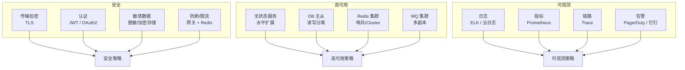

# 互联网金融信贷系统 — 技术架构图

> 基于 [ArchTech.md](./ArchTech.md) 功能需求与 [ArchTechDiagram.md](./ArchTechDiagram.md) 系统架构，从**技术栈与部署**视角描述组件、中间件与基础设施。  
> 图表使用 Mermaid，可在 GitHub / VS Code / 支持 Mermaid 的 Markdown 预览中直接渲染。

---

## 1. 技术栈总览（分层）

从「前端 → 网关 → 服务 → 数据/中间件 → 基础设施」的分层技术选型示意。



---

## 2. 组件与职责（技术组件图）

按业务域拆分的技术组件及其主要职责与技术选型倾向。



---

## 3. 部署架构（逻辑部署图）

逻辑部署层次：用户 → 边缘/网关 → 应用集群 → 数据与外部。



---

## 4. 关键链路技术流（申请 → 放款）

从技术视角看「进件 → 风控 → 授信 → 支用 → 放款」经过的组件与中间件。

```mermaid
sequenceDiagram
    participant C as 客户端
    participant GW as API 网关
    participant BFF as BFF
    participant Apply as 进件服务
    participant Rule as 规则引擎
    participant Score as 评分服务
    participant Credit as 授信服务
    participant Draw as 支用/放款服务
    participant Pay as 支付服务
    participant Redis as Redis
    participant DB as MySQL
    participant MQ as MQ

    C->>GW: 提交进件
    GW->>BFF: 鉴权转发
    BFF->>Apply: 进件请求
    Apply->>Redis: 名单/缓存
    Apply->>Rule: 反欺诈规则
    Rule-->>Apply: 通过/拒绝
    Apply->>Score: 征信+评分
    Score-->>Apply: 评分结果
    Apply->>Credit: 授信审批
    Credit->>DB: 写入额度
    Credit-->>BFF: 授信结果
    BFF-->>C: 授信成功

    C->>GW: 支用申请
    GW->>BFF->>Draw: 支用
    Draw->>Rule: 支用规则
    Draw->>DB: 借据+还款计划
    Draw->>Pay: 放款指令
    Pay->>MQ: 放款消息
    Pay-->>Draw: 放款结果
    Draw-->>C: 放款成功
```

---

## 5. 数据与中间件拓扑

数据库、缓存、消息在业务中的使用场景。



---

## 6. 安全与高可用（逻辑视图）

身份、网络安全与高可用关键点。



---

## 7. 技术栈清单（表格）

便于与架构图对照的选型参考（可按实际替换）。

| 层次 | 组件 | 可选技术 | 说明 |
|------|------|----------|------|
| 前端 | 管理台 | React / Vue3 + TypeScript | 运营工作台、报表 |
| 前端 | 用户端 | Vue / Taro / RN / Flutter | H5、小程序、APP |
| 接入 | 网关 | Kong / APISIX / Spring Cloud Gateway | 鉴权、限流、路由 |
| 接入 | 负载均衡 | Nginx / SLB / ALB | 七层/四层 |
| 服务 | 语言/框架 | Java (Spring Boot) / Go | 信贷核心、风控、支付 |
| 服务 | 规则引擎 | Drools / 自研 / Aviator | 反欺诈、授信、定价规则 |
| 数据 | 关系库 | MySQL 8 / PostgreSQL | 主业务库 |
| 数据 | 缓存 | Redis 6+ Cluster | 会话、名单、限额、分布式锁 |
| 数据 | 消息 | Kafka / RocketMQ | 放款、还款、事件驱动 |
| 数据 | 检索/日志 | Elasticsearch | 日志、工单检索 |
| 基础设施 | 容器/编排 | K8s / 云托管 | 部署与弹性 |
| 基础设施 | 监控 | Prometheus + Grafana | 指标与大盘 |
| 基础设施 | 链路 | Jaeger / SkyWalking | 分布式追踪 |
| 外部 | 支付 | 银行直连 / 三方支付 | 放款、代扣 |
| 外部 | 征信 | 人行/百行/多头 API | 信用评估 |
| 外部 | 合同 | 电子签章/存证 | 合同生成与签署 |

---

## 图例与说明

| 图 | 用途 |
|----|------|
| 1 技术栈总览 | 前端→网关→服务→数据→基础设施 分层技术选型 |
| 2 组件与职责 | 各技术组件归属业务域及与 DB/Redis/MQ 关系 |
| 3 部署架构 | 边缘/网关/应用集群/数据/外部 逻辑部署 |
| 4 关键链路技术流 | 进件→风控→授信→支用→放款 时序与组件 |
| 5 数据与中间件拓扑 | MySQL/Redis/MQ/ES 在业务中的角色 |
| 6 安全与高可用 | 安全、高可用、可观测 要点 |
| 7 技术栈清单 | 与图中对应的选型表格，便于落地替换 |

业务/系统边界与域划分见 [ArchTechDiagram.md](./ArchTechDiagram.md)，功能需求见 [ArchTech.md](./ArchTech.md)。
